# 🚗 Lavadero AL - Sistema de Gestión Integral

<div align="center">


**Sistema completo de gestión para lavaderos de vehículos con control de empleados, inventario, liquidaciones y convenios empresariales.**

[Características](#características) •
[Instalación](#instalación-rápida) •
[Documentación](#documentación) •
[Demo](#demo)

</div>

---

## 📋 Tabla de Contenidos

- [Descripción](#descripción)
- [Características](#características)
- [Tecnologías](#tecnologías)
- [Instalación Rápida](#instalación-rápida)
- [Uso](#uso)
- [Documentación](#documentación)
- [Estructura del Proyecto](#estructura-del-proyecto)
- [Contribuir](#contribuir)
- [Licencia](#licencia)
- [Contacto](#contacto)

## 📖 Descripción

**Lavadero AL** es un sistema integral de gestión diseñado específicamente para lavaderos de vehículos. Permite administrar de manera eficiente todas las operaciones diarias, desde el control de empleados y servicios hasta la gestión de inventario y liquidaciones con convenios empresariales.

### ¿Para quién es este sistema?

- 🏢 **Lavaderos pequeños y medianos** que necesitan digitalizar sus operaciones
- 🚕 **Empresas de transporte** que requieren control de flotas y convenios
- 👥 **Administradores** que buscan métricas y reportes en tiempo real
- 💼 **Emprendedores** del sector automotriz

## ✨ Características

### 🔐 Gestión de Usuarios
- Sistema de autenticación con roles (Admin/Empleado)
- Control de acceso basado en permisos
- Perfiles de usuario personalizables

### 👥 Administración de Empleados
- Registro completo de empleados con RUT y contacto
- Control de estado (activo/inactivo)
- Historial de liquidaciones por empleado
- Cálculo automático de comisiones

### 🚿 Gestión de Servicios
- Catálogo de servicios con precios diferenciados
- Registro detallado de servicios realizados
- Asignación de empleados a servicios
- Control de tipo de vehículo (Auto, SUV, Camioneta, Camión)

### 📦 Control de Inventario
- Gestión de productos e insumos
- Control de stock en tiempo real
- Registro de movimientos (entradas/salidas)
- Alertas de stock mínimo
- Historial completo de movimientos

### 💰 Sistema de Liquidaciones
- Cálculo automático de liquidaciones
- Detalle de servicios por empleado
- Control de pagos y pendientes
- Exportación de comprobantes

### 🤝 Convenios Empresariales
- Gestión de convenios con empresas
- Registro de vehículos por convenio
- Tarifas especiales por convenio
- Facturación mensual automática

### 📊 Dashboard y Reportes
- Métricas en tiempo real
- Gráficos de servicios por período
- Reportes de ingresos y gastos
- Estadísticas de empleados
- Análisis de convenios

### 📋 Gestión de Tarifas
- Precios por tipo de vehículo
- Tarifas especiales para convenios
- Historial de cambios de precios

## 🛠 Tecnologías

### Frontend
- **Vue 3** - Framework JavaScript progresivo
- **Vite** - Build tool y dev server ultra-rápido
- **Vue Router** - Enrutamiento oficial de Vue
- **Pinia** - State management moderno
- **Bootstrap 5** - Framework CSS responsive
- **Bootstrap Icons** - Iconografía
- **Axios** - Cliente HTTP
- **XLSX** - Exportación a Excel

### Backend
- **FastAPI** - Framework Python moderno y de alto rendimiento
- **Uvicorn** - Servidor ASGI
- **MySQL Connector** - Conexión a base de datos
- **Pydantic** - Validación de datos

### Base de Datos
- **MySQL 5.7+** / **MariaDB 10.3+**

## 🚀 Instalación Rápida

### Prerrequisitos

```bash
# Verificar versiones
node --version  # v20.19.0 o superior
python --version  # Python 3.8 o superior
mysql --version  # MySQL 5.7 o superior
```

### 1. Clonar el repositorio

```bash
git clone https://github.com/tuusuario/LavaderoAl3.0.git
cd LavaderoAl3.0
```

### 2. Configurar la base de datos

```bash
# Iniciar MySQL (XAMPP, WAMP o servicio)
# Importar el schema
mysql -u root -p < backend/schema.sql
```

### 3. Configurar el Backend

```bash
cd backend
python -m venv venv
source venv/bin/activate  # En Windows: venv\Scripts\activate
pip install fastapi uvicorn mysql-connector-python pydantic
uvicorn main:app --reload --port 8000
```

### 4. Configurar el Frontend

```bash
# En otra terminal, desde la raíz del proyecto
npm install
npm run dev
```

### 5. Acceder a la aplicación

- **Frontend:** http://localhost:5173
- **API:** http://localhost:8000
- **Documentación API:** http://localhost:8000/docs

### Credenciales por defecto

| Usuario | Contraseña | Rol |
|---------|-----------|-----|
| admin | admin123 | Administrador |
| empleado1 | emp123 | Empleado |

> ⚠️ **Importante:** Cambiar estas credenciales en producción

## 📚 Documentación

- **[Guía de Instalación Completa](INSTALACION.md)** - Instrucciones detalladas paso a paso
- **[Documentación de API](docs/API.md)** - Endpoints y ejemplos de uso
- **[Arquitectura del Sistema](docs/ARCHITECTURE.md)** - Diseño y estructura técnica
- **[Manual de Usuario](docs/MANUAL_USUARIO.md)** - Guía para usuarios finales
- **[Guía de Contribución](CONTRIBUTING.md)** - Cómo contribuir al proyecto

## 📁 Estructura del Proyecto

```
LavaderoAl3.0/
├── backend/                  # API FastAPI
│   ├── routers/             # Endpoints organizados por módulo
│   │   ├── auth.py          # Autenticación
│   │   ├── empleados.py     # Gestión de empleados
│   │   ├── servicios.py     # Servicios de lavado
│   │   ├── inventario.py    # Control de stock
│   │   ├── liquidaciones.py # Cálculo de pagos
│   │   ├── convenios.py     # Convenios empresariales
│   │   ├── tarifas.py       # Gestión de precios
│   │   ├── reportes.py      # Generación de reportes
│   │   └── dashboard.py     # Métricas y estadísticas
│   ├── config.py            # Configuración de BD
│   ├── database.py          # Conexión y utilidades DB
│   ├── schemas.py           # Modelos Pydantic
│   ├── auth_utils.py        # Utilidades de autenticación
│   ├── main.py              # Aplicación principal
│   └── schema.sql           # Schema de base de datos
├── src/                     # Aplicación Vue
│   ├── views/               # Vistas/Páginas
│   ├── components/          # Componentes reutilizables
│   ├── composables/         # Composables de Vue
│   ├── services/            # Servicios y API client
│   ├── stores/              # Stores de Pinia
│   ├── router/              # Configuración de rutas
│   ├── assets/              # Recursos estáticos
│   ├── App.vue              # Componente raíz
│   └── main.js              # Punto de entrada
├── public/                  # Archivos públicos
├── docs/                    # Documentación adicional
├── .env                     # Variables de entorno
├── package.json             # Dependencias Node
├── vite.config.js           # Configuración Vite
└── README.md                # Este archivo
```

## 🎯 Uso

### Inicio Rápido

1. **Iniciar sesión** con las credenciales de administrador
2. **Configurar empleados** en la sección de Empleados
3. **Definir servicios** y sus tarifas
4. **Cargar inventario** inicial
5. **Crear convenios** si trabajas con empresas
6. **Registrar servicios** realizados
7. **Generar liquidaciones** al final del período

### Flujo de Trabajo Típico

```mermaid
graph LR
    A[Cliente llega] --> B[Registrar Servicio]
    B --> C[Asignar Empleado]
    C --> D[Actualizar Inventario]
    D --> E[Servicio Completado]
    E --> F[Generar Liquidación]
    F --> G[Pago a Empleado]
```



### Ejemplos de Uso

#### Registrar un Servicio
1. Ir a "Servicios"
2. Clic en "Nuevo Servicio"
3. Seleccionar tipo de vehículo
4. Asignar empleado
5. Guardar

#### Generar Liquidación
1. Ir a "Liquidaciones"
2. Seleccionar empleado y período
3. Revisar servicios realizados
4. Confirmar y generar liquidación
5. Marcar como pagada

## 🐛 Solución de Problemas

### Error de conexión a la base de datos
```bash
# Verificar que MySQL esté corriendo
sudo systemctl status mysql  # Linux
# o revisar XAMPP panel
```

### Puerto 8000 ya en uso
```bash
# Cambiar el puerto en el comando uvicorn
uvicorn main:app --reload --port 8001
```

### Error de CORS
Verificar que el frontend esté configurado en `backend/main.py` en el array `origins`

## 🤝 Contribuir

¡Las contribuciones son bienvenidas! Por favor lee nuestra [Guía de Contribución](CONTRIBUTING.md) para detalles sobre:

- Código de conducta
- Proceso de pull requests
- Estándares de código
- Convenciones de commits

### Proceso Rápido

1. Fork el proyecto
2. Crea tu rama de característica (`git checkout -b feature/AmazingFeature`)
3. Commit tus cambios (`git commit -m 'Add some AmazingFeature'`)
4. Push a la rama (`git push origin feature/AmazingFeature`)
5. Abre un Pull Request

## 🗺 Roadmap

- [ ] Implementación de JWT para autenticación
- [ ] Subida de imágenes de vehículos
- [ ] Exportación de reportes a PDF
- [ ] Aplicación móvil (React Native)
- [ ] Sistema de notificaciones
- [ ] Integración con sistemas de facturación
- [ ] Dashboard avanzado con BI
- [ ] API pública con documentación OpenAPI
- [ ] Tests unitarios y de integración
- [ ] Deployment con Docker

## 📄 Licencia

Este proyecto está bajo la Licencia MIT. Ver el archivo [LICENSE](LICENSE) para más detalles.

## 👨‍💻 Autor

**Lavadero AL Team**

- GitHub: [@Maruel20](https://github.com/Maruel20)

## 🙏 Agradecimientos

- Vue.js Team por el excelente framework
- FastAPI por la increíble documentación
- Bootstrap por los componentes UI
- La comunidad open source

---

<div align="center">

**[⬆ Volver arriba](#-lavadero-al---sistema-de-gestión-integral)**

Hecho con ❤️ para la gestión eficiente de lavaderos

</div>
